# CI/CD自动化部署

<cite>
**本文档引用的文件**
- [.github/workflows/ci-cd.yml](file://.github/workflows/ci-cd.yml)
- [package.json](file://package.json)
- [turbo.json](file://turbo.json)
- [pnpm-workspace.yaml](file://pnpm-workspace.yaml)
- [vercel.json](file://vercel.json)
- [playwright.config.ts](file://playwright.config.ts)
- [apps/web/package.json](file://apps/web/package.json)
- [apps/web/next.config.js](file://apps/web/next.config.js)
- [apps/web/vitest.config.ts](file://apps/web/vitest.config.ts)
- [vitest.workspace.ts](file://vitest.workspace.ts)
- [apps/web/test-setup.tsx](file://apps/web/test-setup.tsx)
- [apps/web/components/ChatInput.test.tsx](file://apps/web/components/ChatInput.test.tsx)
- [apps/web/lib/theme/ThemeContext.test.tsx](file://apps/web/lib/theme/ThemeContext.test.tsx)
- [apps/web/hooks/useChatStream.test.ts](file://apps/web/hooks/useChatStream.test.ts)
- [docs/CI-CD-SETUP-GUIDE.md](file://docs/CI-CD-SETUP-GUIDE.md)
- [docs/DEPLOYMENT.md](file://docs/DEPLOYMENT.md)
- [README.md](file://README.md)
- [.npmrc](file://.npmrc)
- [apps/web/.npmrc](file://apps/web/.npmrc)
</cite>

## 更新摘要
**所做更改**
- 新增明确的 Node.js 版本要求说明（>=18.0.0）
- 更新 Vercel 配置文件，优化构建流程
- 增强构建命令和安装命令的配置
- 完善部署流程的环境变量配置说明
- **更新** 将测试环境从jsdom切换到happy-dom，解决ESM/CommonJS兼容性问题
- **更新** Vitest版本固定为3.1.0，避免Linux CI环境中ERR_REQUIRE_ESM错误
- **更新** 增强测试配置，支持ESM模块系统和现代JavaScript特性

## 目录
1. [项目简介](#项目简介)
2. [CI/CD架构概览](#cicd架构概览)
3. [核心组件分析](#核心组件分析)
4. [工作流程详解](#工作流程详解)
5. [部署配置分析](#部署配置分析)
6. [测试体系集成](#测试体系集成)
7. [依赖关系分析](#依赖关系分析)
8. [性能与优化](#性能与优化)
9. [故障排除指南](#故障排除指南)
10. [最佳实践建议](#最佳实践建议)

## 项目简介

Web3 AI Agent是一个面向Web3前端开发者的AI Agent项目，采用现代化的Monorepo架构设计。项目基于Next.js 14 + React + TypeScript技术栈，实现了从需求定义到代码交付的完整SDLC自动化流程。

该项目的核心特点包括：
- **AI对话能力**：支持流式输出的智能聊天界面
- **Web3工具集成**：调用链上数据获取可信结果
- **智能代理循环**：理解用户意图并自主决策工具调用
- **会话记忆管理**：保持上下文连续性的最小内存实现

## CI/CD架构概览

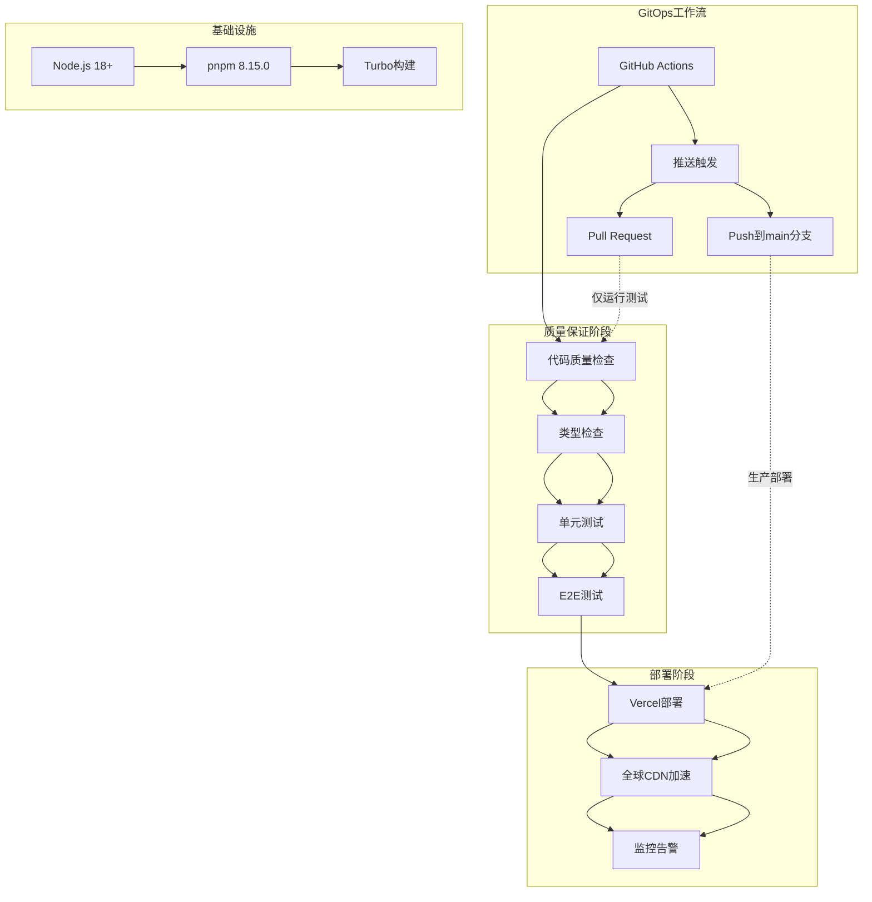

**图表来源**
- [.github/workflows/ci-cd.yml:1-82](file://.github/workflows/ci-cd.yml#L1-L82)
- [package.json:6-16](file://package.json#L6-L16)
- [turbo.json:4-22](file://turbo.json#L4-L22)

## 核心组件分析

### GitHub Actions工作流

CI/CD管道采用双任务设计，确保代码质量和部署效率：

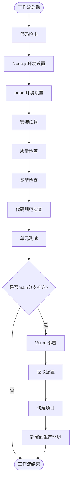

**图表来源**
- [.github/workflows/ci-cd.yml:15-44](file://.github/workflows/ci-cd.yml#L15-L44)
- [.github/workflows/ci-cd.yml:47-82](file://.github/workflows/ci-cd.yml#L47-L82)

### Monorepo构建系统

项目采用Turbo构建系统，实现高效的增量构建和缓存机制：

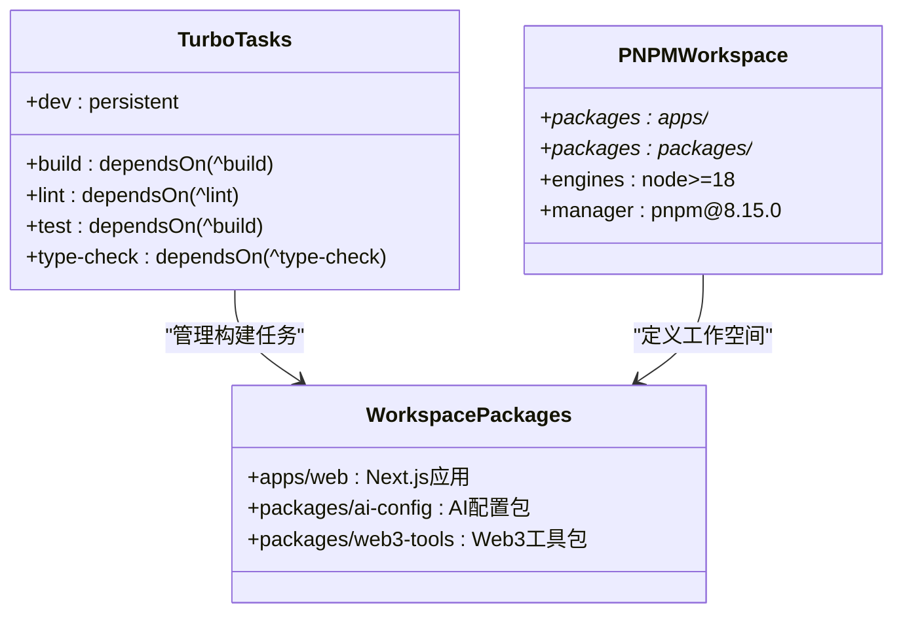

**图表来源**
- [turbo.json:4-22](file://turbo.json#L4-L22)
- [pnpm-workspace.yaml:1-4](file://pnpm-workspace.yaml#L1-L4)
- [package.json:30-34](file://package.json#L30-L34)

**章节来源**
- [.github/workflows/ci-cd.yml:1-82](file://.github/workflows/ci-cd.yml#L1-L82)
- [turbo.json:1-25](file://turbo.json#L1-L25)
- [pnpm-workspace.yaml:1-4](file://pnpm-workspace.yaml#L1-L4)

## 工作流程详解

### 质量保证流水线

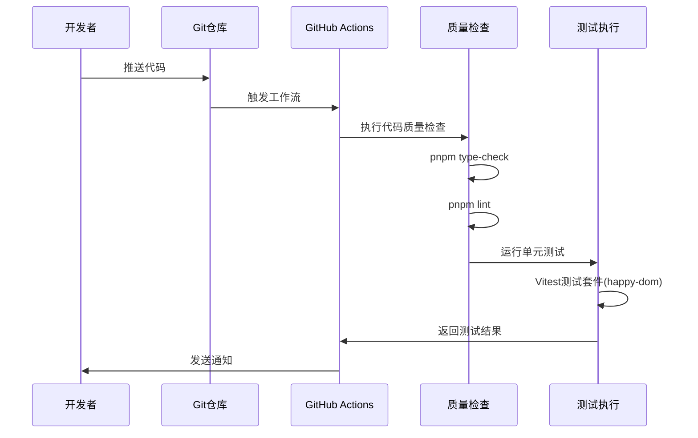

**图表来源**
- [.github/workflows/ci-cd.yml:15-44](file://.github/workflows/ci-cd.yml#L15-L44)
- [apps/web/vitest.config.ts:9-14](file://apps/web/vitest.config.ts#L9-L14)

### 部署流水线

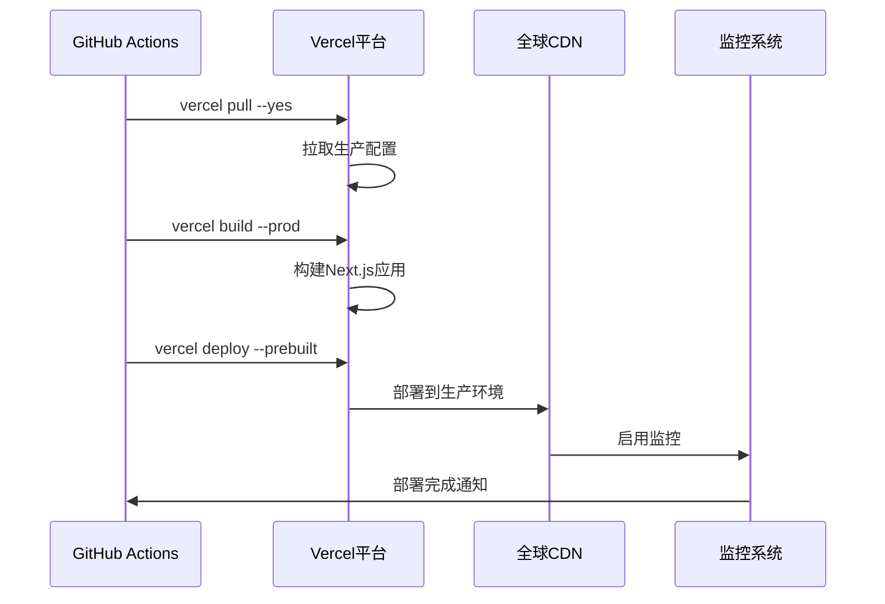

**图表来源**
- [.github/workflows/ci-cd.yml:71-81](file://.github/workflows/ci-cd.yml#L71-L81)
- [vercel.json:1-11](file://vercel.json#L1-L11)

**章节来源**
- [.github/workflows/ci-cd.yml:46-82](file://.github/workflows/ci-cd.yml#L46-L82)
- [vercel.json:1-11](file://vercel.json#L1-L11)

## 部署配置分析

### Vercel集成配置

项目采用Vercel作为主要部署平台，配置了完整的CI/CD自动化：

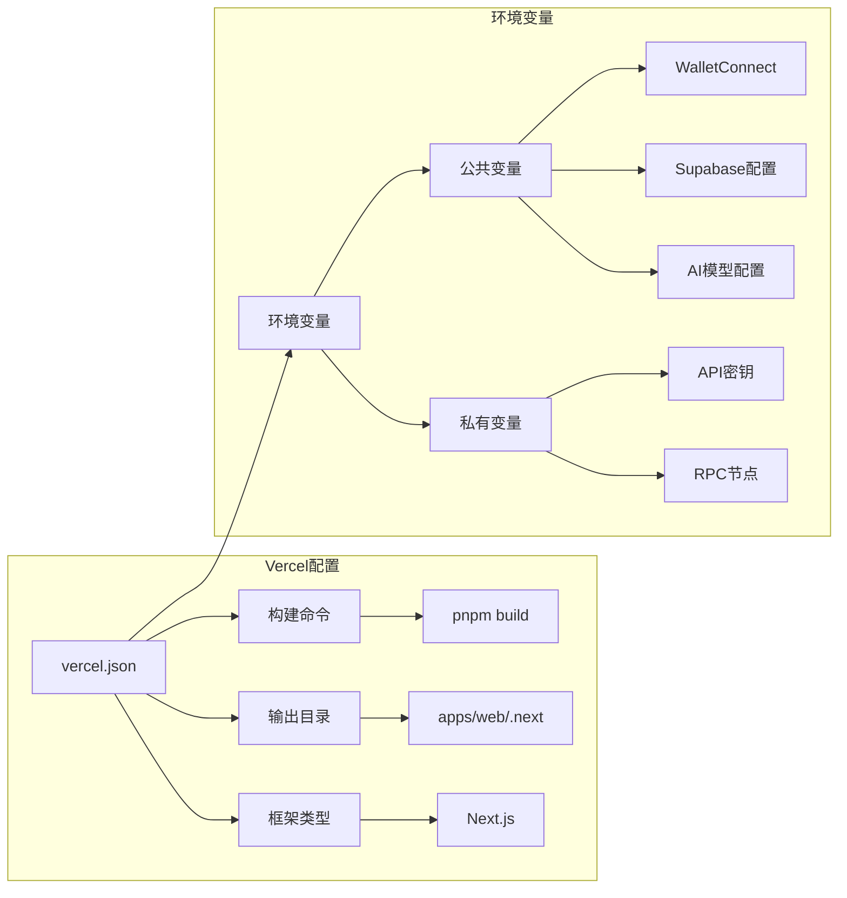

**图表来源**
- [vercel.json:1-11](file://vercel.json#L1-L11)
- [docs/CI-CD-SETUP-GUIDE.md:34-52](file://docs/CI-CD-SETUP-GUIDE.md#L34-L52)

### Next.js应用配置

应用层采用现代化的Next.js配置，支持AI SDK流式响应：

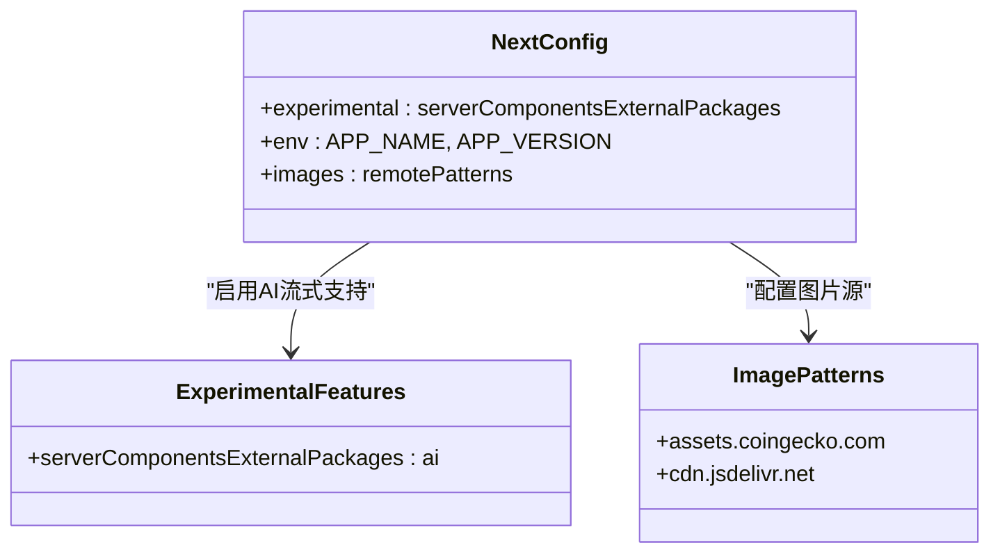

**图表来源**
- [apps/web/next.config.js:3-27](file://apps/web/next.config.js#L3-L27)

### 依赖管理配置

项目采用pnpm进行依赖管理，并通过.npmrc配置解决TailwindCSS依赖问题：

**更新** 增强.npmrc配置说明，详细解释shamefully-hoist的作用

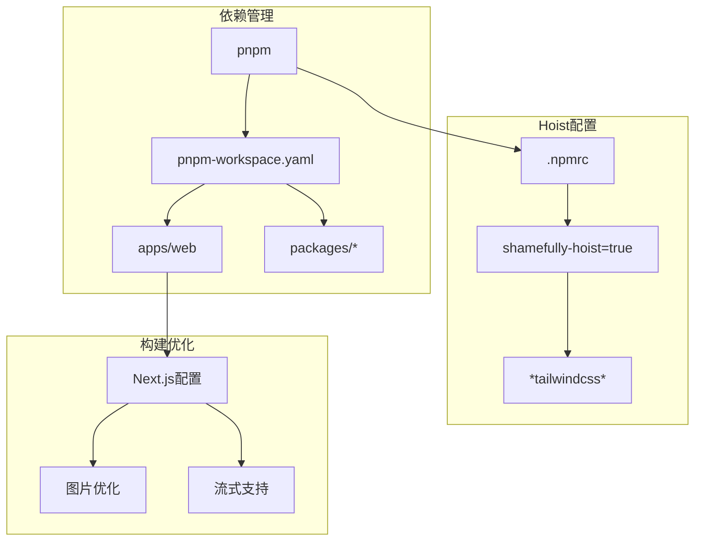

**图表来源**
- [.npmrc:1-2](file://.npmrc#L1-L2)
- [pnpm-workspace.yaml:1-4](file://pnpm-workspace.yaml#L1-L4)

**章节来源**
- [vercel.json:1-11](file://vercel.json#L1-L11)
- [apps/web/next.config.js:1-30](file://apps/web/next.config.js#L1-L30)
- [docs/CI-CD-SETUP-GUIDE.md:20-52](file://docs/CI-CD-SETUP-GUIDE.md#L20-L52)
- [.npmrc:1-2](file://.npmrc#L1-L2)

## 测试体系集成

### 多层次测试架构

项目建立了完整的测试金字塔，从单元测试到端到端测试：

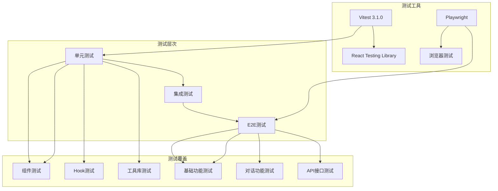

**图表来源**
- [apps/web/vitest.config.ts:9-14](file://apps/web/vitest.config.ts#L9-L14)
- [playwright.config.ts:12-79](file://playwright.config.ts#L12-L79)

### 测试配置详解

**更新** 测试环境已从jsdom切换到happy-dom，提供更好的ESM/CommonJS兼容性

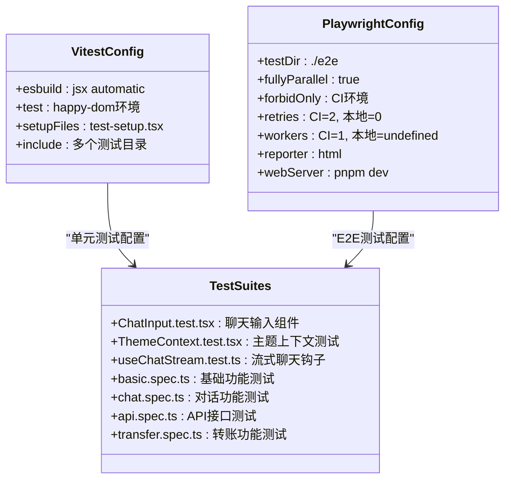

**图表来源**
- [apps/web/vitest.config.ts:1-23](file://apps/web/vitest.config.ts#L1-L23)
- [playwright.config.ts:12-79](file://playwright.config.ts#L12-L79)

### Vitest版本兼容性优化

**更新** 为了解决Linux CI环境中ESM/CommonJS兼容性问题，项目已将Vitest版本从3.2.4降级至3.1.0，避免ERR_REQUIRE_ESM错误

**更新** 测试环境已从jsdom切换到happy-dom，提供更好的DOM模拟和ESM兼容性

项目采用统一的Vitest配置，支持ESM模块系统和现代JavaScript特性：

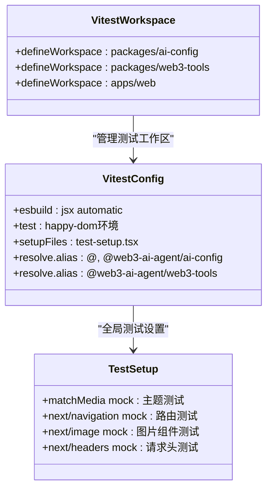

**图表来源**
- [vitest.workspace.ts:1-8](file://vitest.workspace.ts#L1-L8)
- [apps/web/vitest.config.ts:1-23](file://apps/web/vitest.config.ts#L1-L23)
- [apps/web/test-setup.tsx:1-47](file://apps/web/test-setup.tsx#L1-L47)

**章节来源**
- [apps/web/vitest.config.ts:1-23](file://apps/web/vitest.config.ts#L1-L23)
- [playwright.config.ts:1-79](file://playwright.config.ts#L1-L79)
- [vitest.workspace.ts:1-8](file://vitest.workspace.ts#L1-L8)
- [apps/web/test-setup.tsx:1-47](file://apps/web/test-setup.tsx#L1-L47)

## 依赖关系分析

### Monorepo依赖图

```mermaid
graph TB
subgraph "根目录"
RootPkg[根package.json] --> Scripts[构建脚本]
RootPkg --> Workspaces[工作空间配置]
end
subgraph "应用层"
WebApp[apps/web] --> NextJS[Next.js 14]
WebApp --> React[React 18]
WebApp --> AI[AI SDK]
WebApp --> Web3Tools[@web3-ai-agent/web3-tools]
WebApp --> AIConfig[@web3-ai-agent/ai-config]
end
subgraph "共享包"
Web3Tools[web3-tools] --> Ethers[Ethers.js]
Web3Tools --> Viem[Viem]
Web3Tools --> Wagmi[Wagmi]
AIConfig[ai-config] --> OpenAI[OpenAI API]
AIConfig --> Anthropic[Anthropic API]
end
subgraph "开发工具"
Turbo[turbo] --> PNPM[pnpm]
ESLint[ESLint] --> Prettier[Prettier]
Vitest[Vitest 3.1.0] --> Playwright[Playwright]
HappyDOM[happy-dom] --> Vitest[测试环境]
End
RootPkg --> WebApp
WebApp --> Web3Tools
WebApp --> AIConfig
Web3Tools --> Ethers
AIConfig --> OpenAI
```

**图表来源**
- [apps/web/package.json:14-33](file://apps/web/package.json#L14-L33)
- [package.json:18-25](file://package.json#L18-L25)

### 构建依赖链

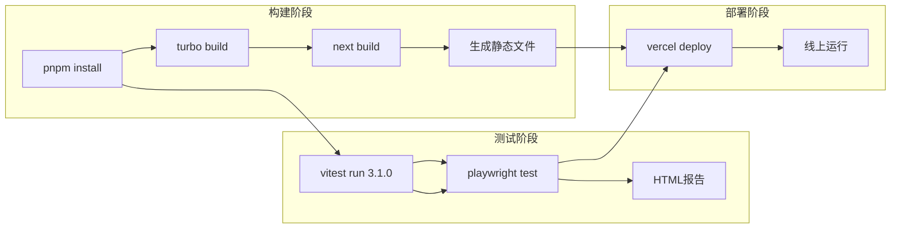

**图表来源**
- [package.json:6-16](file://package.json#L6-L16)
- [turbo.json:5-8](file://turbo.json#L5-L8)

**章节来源**
- [package.json:1-35](file://package.json#L1-L35)
- [apps/web/package.json:1-54](file://apps/web/package.json#L1-L54)
- [turbo.json:1-25](file://turbo.json#L1-L25)

## 性能与优化

### 构建性能优化

项目采用了多项性能优化措施：

1. **增量构建**：Turbo提供智能缓存和增量构建
2. **并行执行**：多任务并行处理提高效率
3. **依赖管理**：pnpm提供快速依赖安装
4. **代码分割**：Next.js自动代码分割优化加载

### 部署性能优化

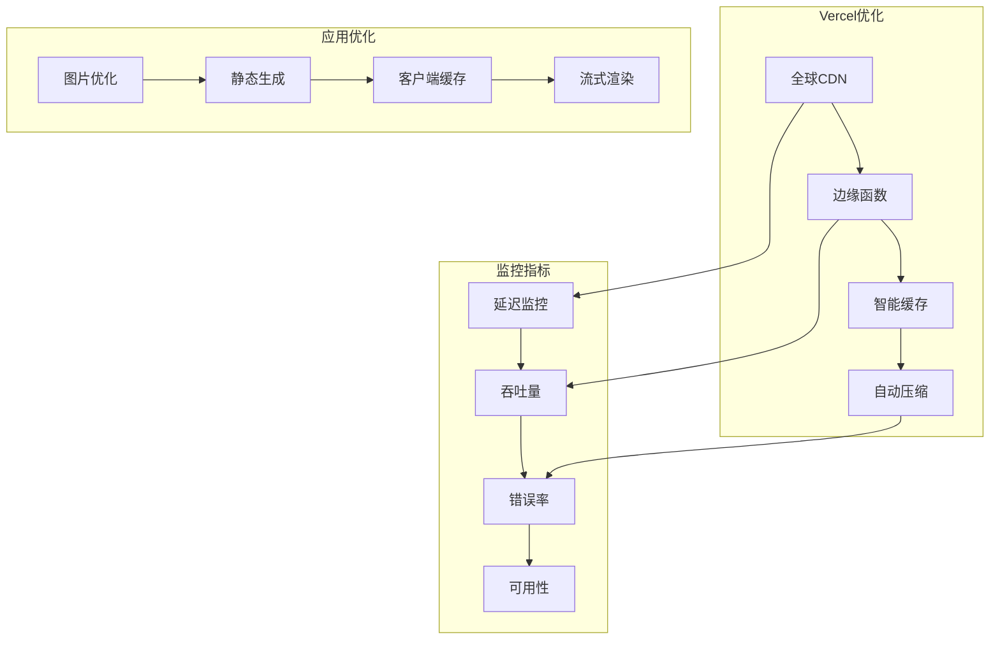

**图表来源**
- [vercel.json:1-11](file://vercel.json#L1-L11)
- [apps/web/next.config.js:13-26](file://apps/web/next.config.js#L13-L26)

## 故障排除指南

### 常见问题诊断

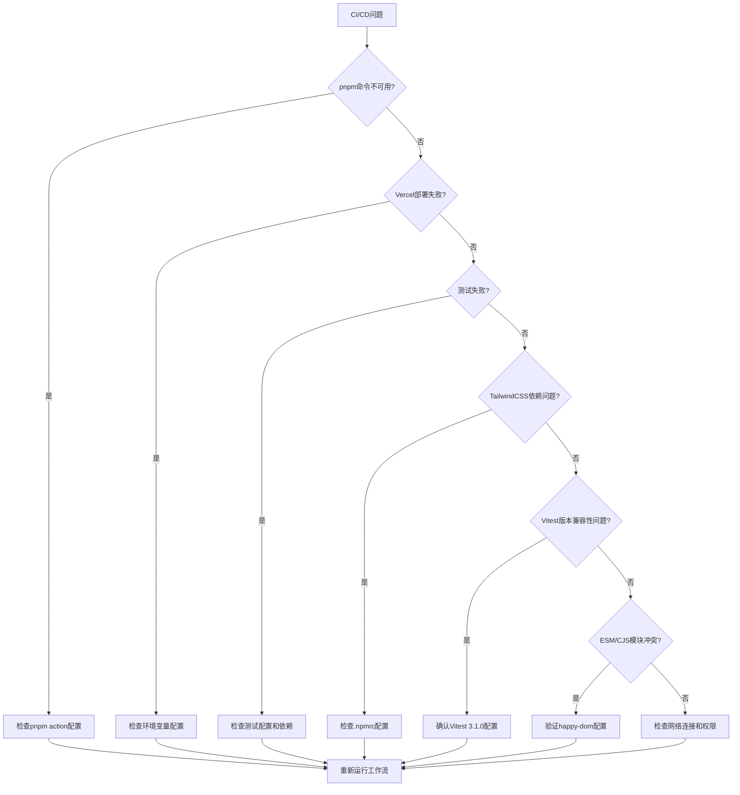

### 问题排查步骤

1. **环境配置检查**
   - 验证Node.js版本兼容性（>=18.0.0）
   - 检查pnpm版本和缓存
   - 确认GitHub Secrets配置

2. **构建问题诊断**
   - 检查依赖安装日志
   - 验证TypeScript编译
   - 分析构建缓存状态

3. **部署问题解决**
   - 查看Vercel部署日志
   - 验证环境变量同步
   - 检查CDN缓存状态

4. **测试问题解决**
   - **更新** 验证Vitest版本为3.1.0，避免ESM/CommonJS兼容性问题
   - **更新** 确认测试环境使用happy-dom而非jsdom
   - 检查测试配置文件路径和别名设置
   - 确认测试环境模拟配置正确

5. **模块系统冲突解决**
   - **新增** 验证ESM模块导入语法
   - **新增** 检查CommonJS与ESM混合使用的兼容性
   - **新增** 确认package.json中的module字段配置

**章节来源**
- [docs/CI-CD-SETUP-GUIDE.md:153-177](file://docs/CI-CD-SETUP-GUIDE.md#L153-L177)
- [.github/workflows/ci-cd.yml:9-11](file://.github/workflows/ci-cd.yml#L9-L11)

## 最佳实践建议

### CI/CD最佳实践

1. **工作流优化**
   - 使用矩阵构建支持多版本测试
   - 实施缓存策略减少重复工作
   - 配置适当的重试机制

2. **质量保证**
   - 实施代码覆盖率阈值
   - 集成安全扫描工具
   - 建立性能回归检测

3. **部署策略**
   - 采用蓝绿部署降低风险
   - 实施回滚机制
   - 建立灰度发布流程

### 监控与告警

```mermaid
graph LR
subgraph "监控层次"
BuildMonitor[构建监控] --> DeployMonitor[部署监控]
DeployMonitor --> RuntimeMonitor[运行时监控]
end
subgraph "告警机制"
BuildAlert[构建失败告警]
DeployAlert[部署异常告警]
RuntimeAlert[性能告警]
End
subgraph "通知渠道"
Slack[Slack通知]
Email[邮件通知]
Webhook[Webhook集成]
end
BuildMonitor --> BuildAlert
DeployMonitor --> DeployAlert
RuntimeMonitor --> RuntimeAlert
BuildAlert --> Slack
DeployAlert --> Email
RuntimeAlert --> Webhook
```

### 持续改进

1. **定期审查**
   - 评估CI/CD性能指标
   - 分析失败原因统计
   - 优化资源配置

2. **技术升级**
   - 跟踪新工具和最佳实践
   - 升级依赖版本
   - 改进测试覆盖率

### Vitest版本管理最佳实践

**更新** 关于Vitest版本降级和测试环境切换的注意事项

为确保Linux CI环境的稳定性，项目已将Vitest版本固定为3.1.0，并将测试环境从jsdom切换到happy-dom，这是为了解决ESM/CommonJS兼容性问题而做出的重要调整：

- **版本选择**：Vitest 3.1.0版本在Linux环境中表现更加稳定
- **兼容性保障**：避免ERR_REQUIRE_ESM错误，确保测试在CI/CD环境中正常运行
- **环境优化**：happy-dom提供更好的DOM模拟和ESM兼容性
- **向后兼容**：该版本仍支持现代JavaScript特性，满足项目测试需求
- **未来升级策略**：将持续监控Vitest新版本，一旦ESM/CommonJS兼容性问题得到解决，将考虑升级到更高版本

### 测试环境配置最佳实践

**更新** 测试环境从jsdom到happy-dom的迁移说明

项目已完成从jsdom到happy-dom的测试环境迁移，这一变更带来了以下改进：

- **ESM兼容性**：happy-dom对ESM模块系统的支持更好
- **DOM模拟**：提供更完整的DOM API支持
- **性能提升**：相比jsdom具有更好的性能表现
- **稳定性**：在Linux CI环境中更加稳定可靠

**章节来源**
- [docs/CI-CD-SETUP-GUIDE.md:170-177](file://docs/CI-CD-SETUP-GUIDE.md#L170-L177)
- [docs/DEPLOYMENT.md:702-791](file://docs/DEPLOYMENT.md#L702-L791)
- [apps/web/vitest.config.ts:9-11](file://apps/web/vitest.config.ts#L9-L11)
- [package.json:24](file://package.json#L24)
- [apps/web/package.json:47](file://apps/web/package.json#L47)

### 环境变量配置优化

**更新** 增强.npmrc配置说明，详细解释shamefully-hoist的作用

**项目环境变量配置优化**：
项目环境变量配置现已支持更灵活的API配置：

| 变量名 | 说明 | 默认值 |
|--------|------|--------|
| `OPENAI_BASE_URL` | OpenAI API代理地址 | `https://api.openai.com/v1` |
| `ANTHROPIC_BASE_URL` | Anthropic API代理地址 | `https://api.anthropic.com/v1` |
| `DEFAULT_MODEL_PROVIDER` | 默认模型提供商 | `openai` |

**.npmrc配置详细说明**：
项目通过.npmrc配置`shamefully-hoist=true`来解决pnpm严格模式下Next.js无法解析tailwindcss依赖的问题。这一配置确保了在monorepo环境中，Next.js的CSS插件能够正确找到和解析tailwindcss依赖，从而提升构建过程的可靠性。

**Node.js版本要求说明**：
项目现在要求Node.js版本为18及以上（>=18.0.0）。根目录的package.json明确声明了引擎要求，而apps/web/package.json则要求更高版本（>=18.18.0）。在CI/CD流程中，GitHub Actions工作流固定使用Node.js 18版本，确保开发、测试和部署环境的一致性。

**Vercel配置优化**：
vercel.json文件现在包含了更精确的构建配置，包括明确的构建命令和安装命令，以及Git部署启用配置。这些优化确保了部署流程的稳定性和可预测性。

**Vitest版本降级说明**：
为了解决Linux CI环境中ESM/CommonJS兼容性问题，项目已将Vitest版本从3.2.4降级至3.1.0。这一变更避免了ERR_REQUIRE_ESM错误，确保测试在不同操作系统环境下都能稳定运行。新的版本配置已在所有相关配置文件中更新，包括根package.json和apps/web/package.json。

**测试环境切换说明**：
为了解决JavaScript模块系统冲突问题，项目已将测试环境从jsdom切换到happy-dom。这一变更提供了更好的ESM兼容性和DOM模拟支持，避免了构建失败和测试崩溃问题。

**章节来源**
- [docs/DEPLOYMENT.md:472-484](file://docs/DEPLOYMENT.md#L472-L484)
- [.npmrc:1-2](file://.npmrc#L1-L2)
- [apps/web/.npmrc:1-2](file://apps/web/.npmrc#L1-L2)
- [package.json:27-28](file://package.json#L27-L28)
- [apps/web/package.json:50-51](file://apps/web/package.json#L50-L51)
- [vercel.json:1-11](file://vercel.json#L1-L11)
- [.github/workflows/ci-cd.yml:9-11](file://.github/workflows/ci-cd.yml#L9-L11)
- [package.json:24](file://package.json#L24)
- [apps/web/package.json:10](file://apps/web/package.json#L10)
- [apps/web/vitest.config.ts:9-11](file://apps/web/vitest.config.ts#L9-L11)