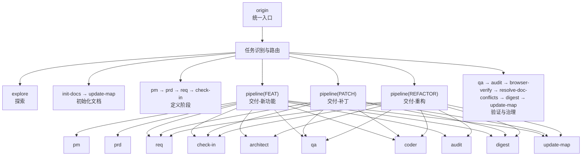
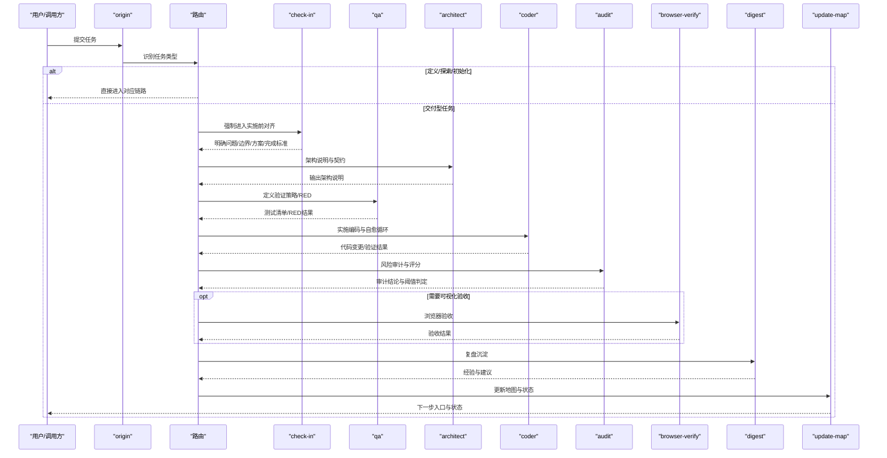
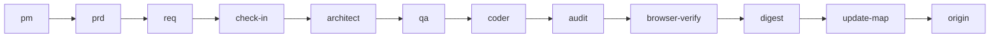

# 风险控制与安全

<cite>
**本文引用的文件**
- [web3-ai-agent 总入口 SKILL.md](file://skills/web3-ai-agent/SKILL.md)
- [architect 架构说明 SKILL.md](file://skills/web3-ai-agent/architect/SKILL.md)
- [audit 审计 SKILL.md](file://skills/web3-ai-agent/audit/SKILL.md)
- [browser-verify 浏览器验收 SKILL.md](file://skills/web3-ai-agent/browser-verify/SKILL.md)
- [check-in 实施前对齐 SKILL.md](file://skills/web3-ai-agent/check-in/SKILL.md)
- [coder 编码实现 SKILL.md](file://skills/web3-ai-agent/coder/SKILL.md)
- [digest 复盘沉淀 SKILL.md](file://skills/web3-ai-agent/digest/SKILL.md)
- [update-map 地图更新 SKILL.md](file://skills/web3-ai-agent/update-map/SKILL.md)
- [pm 产品管理 SKILL.md](file://skills/web3-ai-agent/pm/PM.md)
- [prd 产品需求 SKILL.md](file://skills/web3-ai-agent/prd/PRD.md)
- [req 需求拆解 SKILL.md](file://skills/web3-ai-agent/req/REQ.md)
- [resolve-doc-conflicts 文档冲突解决 SKILL.md](file://skills/web3-ai-agent/resolve-doc-conflicts/SKILL.md)
- [init-docs 初始化文档 SKILL.md](file://skills/web3-ai-agent/init-docs/SKILL.md)
</cite>

## 目录
1. [简介](#简介)
2. [项目结构](#项目结构)
3. [核心组件](#核心组件)
4. [架构总览](#架构总览)
5. [详细组件分析](#详细组件分析)
6. [依赖分析](#依赖分析)
7. [性能考量](#性能考量)
8. [故障排查指南](#故障排查指南)
9. [结论](#结论)
10. [附录](#附录)

## 简介
本文件面向安全工程师与高级开发者，系统化梳理 AI-Agent 项目在风险控制与安全方面的机制设计与落地实践。围绕高风险问题识别、风险等级评估、风险提示策略、安全检查清单、安全审计流程、Web3 特殊安全考虑（智能合约交互、交易安全、资金保护）、安全最佳实践、代码审查指导、漏洞检测方法、风险评估模板、安全测试用例与应急响应流程进行深入阐述。

## 项目结构
该项目采用“技能（Skill）+ 管道（Pipeline）”的分层编排结构，将任务从入口统一接入，依据任务类型进行路由，确保交付型任务在进入实施前经过严格的前置对齐与门禁校验；在交付过程中贯穿 QA、审计、复盘与地图更新，形成闭环的风险控制与知识沉淀。

**图表来源**
- [web3-ai-agent 总入口 SKILL.md:15-158](file://skills/web3-ai-agent/SKILL.md#L15-L158)

**章节来源**
- [web3-ai-agent 总入口 SKILL.md:1-224](file://skills/web3-ai-agent/SKILL.md#L1-L224)

## 核心组件
- 统一入口与路由：所有外部调用统一经 origin 进入，自动识别任务类型并路由至对应链路，避免绕过门禁。
- 实施前对齐（check-in）：强制门禁，明确问题、边界、方案与完成标准，防止盲目实施。
- 质量与安全门禁（QA、audit）：QA 以测试驱动验证，audit 以评分与阈值控制交付放行，形成双重安全闸门。
- 可视化与交互验收（browser-verify）：针对前端与交互进行可视化回归验证，补充自动化覆盖不足。
- 复盘与地图更新（digest、update-map）：沉淀经验、更新状态，持续优化流程与风险基线。
- 文档治理（resolve-doc-conflicts、init-docs、update-map）：分离生成物与手写文档，规范冲突处理与地图演进。

**章节来源**
- [web3-ai-agent 总入口 SKILL.md:15-158](file://skills/web3-ai-agent/SKILL.md#L15-L158)
- [check-in 实施前对齐 SKILL.md:1-56](file://skills/web3-ai-agent/check-in/SKILL.md#L1-L56)
- [qa SKILL.md:1-73](file://skills/web3-ai-agent/qa/SKILL.md#L1-L73)
- [audit SKILL.md:1-88](file://skills/web3-ai-agent/audit/SKILL.md#L1-L88)
- [browser-verify SKILL.md:1-52](file://skills/web3-ai-agent/browser-verify/SKILL.md#L1-L52)
- [digest SKILL.md:1-50](file://skills/web3-ai-agent/digest/SKILL.md#L1-L50)
- [update-map SKILL.md:1-47](file://skills/web3-ai-agent/update-map/SKILL.md#L1-L47)
- [resolve-doc-conflicts SKILL.md:1-40](file://skills/web3-ai-agent/resolve-doc-conflicts/SKILL.md#L1-L40)
- [init-docs SKILL.md:1-41](file://skills/web3-ai-agent/init-docs/SKILL.md#L1-L41)

## 架构总览
下图展示交付型任务在进入实施前后的关键安全节点与流转关系，强调“先对齐、后实施、再验证、后沉淀”的闭环控制。

**图表来源**
- [web3-ai-agent 总入口 SKILL.md:15-158](file://skills/web3-ai-agent/SKILL.md#L15-L158)
- [check-in 实施前对齐 SKILL.md:1-56](file://skills/web3-ai-agent/check-in/SKILL.md#L1-L56)
- [architect 架构说明 SKILL.md:1-53](file://skills/web3-ai-agent/architect/ARCHITECT.md#L1-L53)
- [qa SKILL.md:1-73](file://skills/web3-ai-agent/qa/SKILL.md#L1-L73)
- [coder 编码实现 SKILL.md:1-72](file://skills/web3-ai-agent/coder/SKILL.md#L1-L72)
- [audit SKILL.md:1-88](file://skills/web3-ai-agent/audit/SKILL.md#L1-L88)
- [browser-verify SKILL.md:1-52](file://skills/web3-ai-agent/browser-verify/SKILL.md#L1-L52)
- [digest SKILL.md:1-50](file://skills/web3-ai-agent/digest/SKILL.md#L1-L50)
- [update-map SKILL.md:1-47](file://skills/web3-ai-agent/update-map/SKILL.md#L1-L47)

## 详细组件分析

### 统一入口与路由（origin）
- 作用：所有外部调用统一入口，自动识别任务类型并路由，避免绕过门禁。
- 关键规则：
  - 不允许跳过 origin 直接进入主链。
  - 交付型任务必须经 pipeline。
  - 仅 FEAT 默认先由 qa 执行 RED。
- 安全意义：集中化入口便于审计、追踪与风险拦截。

**章节来源**
- [web3-ai-agent 总入口 SKILL.md:15-167](file://skills/web3-ai-agent/SKILL.md#L15-L167)

### 实施前对齐（check-in）
- 作用：实施前门禁，防止盲目实施、扩大范围与边界不清。
- 强制场景：DELIVER-FEAT/PATCH/REFACTOR、DEFINE 准备进入实施的任务。
- 输出模板：问题、上下文、方案、不做什么、产物、完成标准、下一跳。
- 硬规则：
  - 无 check-in 不进入 architect/qa/coder。
  - 必须明确“不做什么”。
  - 必须明确完成标准，否则视为未完成。
- 安全意义：将风险前置，确保每轮交付的边界可控、可验证、可追溯。

**章节来源**
- [check-in 实施前对齐 SKILL.md:1-56](file://skills/web3-ai-agent/check-in/SKILL.md#L1-L56)

### 质量与验证（qa）
- 两种模式：
  - RED 模式（FEAT）：在实现前先写测试/验证清单并执行红灯验证，最多运行两次。
  - VERIFY 模式（PATCH/REFACTOR）：轻量验证或回归验证。
- 红绿规则：FEAT 先红后绿；QA 负责 RED；coder 负责将 RED 变绿。
- 安全意义：以测试驱动验证，尽早暴露设计与实现偏差，降低回归风险。

**章节来源**
- [qa SKILL.md:1-73](file://skills/web3-ai-agent/qa/SKILL.md#L1-L73)

### 架构与契约（architect）
- 适用场景：接口/状态流/模块边界变化或结构性重构。
- 输出：架构说明、模块边界、数据流、消息流、接口契约、错误处理、风险点。
- 边界：不直接写测试、不直接编码。
- 安全意义：通过契约与边界约束，降低跨模块耦合带来的安全风险。

**章节来源**
- [architect 架构说明 SKILL.md:1-53](file://skills/web3-ai-agent/architect/ARCHITECT.md#L1-L53)

### 编码与自愈（coder）
- 自愈循环：最多 10 轮，超限则终止并输出 STUCK 报告，请求人工介入。
- 与 QA 的衔接：将 RED 全部变为 GREEN；若发现 QA 红灯与需求矛盾，停止并报告。
- 安全意义：通过限定迭代次数与失败根因分析，避免无限试错导致的累积风险。

**章节来源**
- [coder 编码实现 SKILL.md:1-72](file://skills/web3-ai-agent/coder/SKILL.md#L1-L72)

### 审计与放行（audit）
- 两种模式：
  - 轻审：PATCH、低风险 REFACTOR。
  - 重审：FEAT、高风险 PATCH/REFACTOR、涉及 Web3 数据/权限/资金/安全的任务。
- 评分维度（满分 100）：需求一致性、结构/契约一致性、安全与风险边界、代码质量、回归风险控制、文档与状态收尾、场景特定治理项。
- 阈值规则：>=80 通过；60-79 软拒绝回 coder；<60 直接拒绝并终止。
- 一票否决项：严重安全问题、明显越界修改、关键不变量被破坏、高风险场景缺少风险提示或失败降级。
- 安全意义：以量化评分与阈值控制交付放行，形成最后一道风险关。

**章节来源**
- [audit SKILL.md:1-88](file://skills/web3-ai-agent/audit/SKILL.md#L1-L88)

### 可视化与交互验收（browser-verify）
- 适用场景：前端页面验收、交互流程验证、可视回归检查、PATCH 的浏览器级复验。
- 流程：进入目标页面、执行验证步骤、记录关键结果、检查可视与交互回归。
- 安全意义：补充自动化测试在 UI/交互层面的覆盖，降低用户侧风险。

**章节来源**
- [browser-verify SKILL.md:1-52](file://skills/web3-ai-agent/browser-verify/SKILL.md#L1-L52)

### 复盘与地图更新（digest、update-map）
- digest：沉淀本轮完成项、问题、经验与建议，强调“为什么卡住/为什么成功”。
- update-map：更新项目状态、索引与下一步入口，确保下一轮任务基于最新上下文推进。
- 安全意义：通过经验沉淀与状态同步，持续优化风险基线与流程效率。

**章节来源**
- [digest SKILL.md:1-50](file://skills/web3-ai-agent/digest/SKILL.md#L1-L50)
- [update-map SKILL.md:1-47](file://skills/web3-ai-agent/update-map/SKILL.md#L1-L47)

### 文档治理（resolve-doc-conflicts、init-docs）
- resolve-doc-conflicts：区分生成物与手写文档，生成物优先重建，手写内容优先保留信息，无法安全判断时显式标记人工介入。
- init-docs：新项目初始化文档体系、首次建立地图，完成后移交正常 V3 链路。
- 安全意义：避免文档冲突污染审计与规划类文档，确保治理与代码修复分离。

**章节来源**
- [resolve-doc-conflicts SKILL.md:1-40](file://skills/web3-ai-agent/resolve-doc-conflicts/SKILL.md#L1-L40)
- [init-docs SKILL.md:1-41](file://skills/web3-ai-agent/init-docs/SKILL.md#L1-L41)

### 定义阶段（pm、prd、req）
- pm：目标模糊时整理价值主张、用户场景与 MVP 方向。
- prd：定义正式范围、非目标与验收标准，并明确风险边界。
- req：将 PRD/缺陷/重构目标拆成最小可执行任务卡，写清来源、目标、影响范围、依赖关系、验收标准与下一跳。
- 安全意义：在早期阶段明确“做什么、不做什么、如何验收”，降低需求漂移带来的安全风险。

**章节来源**
- [pm SKILL.md:1-53](file://skills/web3-ai-agent/pm/PM.md#L1-L53)
- [prd SKILL.md:1-54](file://skills/web3-ai-agent/prd/PRD.md#L1-L54)
- [req SKILL.md:1-57](file://skills/web3-ai-agent/req/REQ.md#L1-L57)

## 依赖分析
- 组件耦合与协作：
  - origin 作为唯一入口，耦合路由与门禁规则。
  - check-in 为交付型任务的强依赖，向上游依赖 pm/prd/req 的边界定义。
  - architect 为高风险变更提供契约与边界约束，向下连接 QA 与 coder。
  - audit 作为门禁，向上游依赖架构说明与 QA 结果，向下游决定进入 digest 或回退 coder。
  - browser-verify 与 digest、update-map 分别负责验收与状态演进。
- 风险控制路径：
  - 需求与边界：pm/prd/req。
  - 设计与契约：architect。
  - 测试与验证：qa。
  - 实施与自愈：coder。
  - 审计与放行：audit。
  - 验收与复盘：browser-verify、digest、update-map。

**图表来源**
- [web3-ai-agent 总入口 SKILL.md:15-158](file://skills/web3-ai-agent/SKILL.md#L15-L158)
- [pm SKILL.md:1-53](file://skills/web3-ai-agent/pm/PM.md#L1-L53)
- [prd SKILL.md:1-54](file://skills/web3-ai-agent/prd/PRD.md#L1-L54)
- [req SKILL.md:1-57](file://skills/web3-ai-agent/req/REQ.md#L1-L57)
- [check-in 实施前对齐 SKILL.md:1-56](file://skills/web3-ai-agent/check-in/SKILL.md#L1-L56)
- [architect 架构说明 SKILL.md:1-53](file://skills/web3-ai-agent/architect/ARCHITECT.md#L1-L53)
- [qa SKILL.md:1-73](file://skills/web3-ai-agent/qa/SKILL.md#L1-L73)
- [coder 编码实现 SKILL.md:1-72](file://skills/web3-ai-agent/coder/SKILL.md#L1-L72)
- [audit SKILL.md:1-88](file://skills/web3-ai-agent/audit/SKILL.md#L1-L88)
- [browser-verify SKILL.md:1-52](file://skills/web3-ai-agent/browser-verify/SKILL.md#L1-L52)
- [digest SKILL.md:1-50](file://skills/web3-ai-agent/digest/SKILL.md#L1-L50)
- [update-map SKILL.md:1-47](file://skills/web3-ai-agent/update-map/SKILL.md#L1-L47)

## 性能考量
- 评审与验证成本控制：通过 RED 模式与 VERIFY 模式的差异化策略，减少不必要的全量验证开销。
- 自愈循环上限：coder 的 10 轮自愈限制避免长时间阻塞，提升整体交付吞吐。
- 文档治理分离：resolve-doc-conflicts 将生成物与手写文档分离，降低冲突处理的时间成本。
- 地图更新与复盘：digest 与 update-map 的职责分离，确保状态演进与经验沉淀互不干扰。

[本节为通用性能讨论，无需列出章节来源]

## 故障排查指南
- 常见问题定位
  - 未通过 check-in：检查是否遗漏“不做什么”与完成标准。
  - audit 低分或软拒绝：核查需求一致性、结构/契约一致性、安全与风险边界、代码质量、回归风险控制、文档与状态收尾。
  - coder 卡住：查看 STUCK 报告，聚焦“卡住原因、已尝试方案、当前阻塞点、建议人工介入方向”。
  - browser-verify 失败：回退 coder 并补充交互与可视回归验证。
- 应急响应
  - 一票否决项触发：立即终止并人工介入，优先处理严重安全问题与关键不变量破坏。
  - 文档冲突：使用 resolve-doc-conflicts 分离生成物与手写文档，无法判断时显式标记人工复核。

**章节来源**
- [check-in 实施前对齐 SKILL.md:51-56](file://skills/web3-ai-agent/check-in/SKILL.md#L51-L56)
- [audit SKILL.md:64-88](file://skills/web3-ai-agent/audit/SKILL.md#L64-L88)
- [coder 编码实现 SKILL.md:39-59](file://skills/web3-ai-agent/coder/SKILL.md#L39-L59)
- [browser-verify SKILL.md:43-47](file://skills/web3-ai-agent/browser-verify/SKILL.md#L43-L47)
- [resolve-doc-conflicts SKILL.md:36-40](file://skills/web3-ai-agent/resolve-doc-conflicts/SKILL.md#L36-L40)

## 结论
本项目通过“统一入口 + 实施前对齐 + 质量与安全门禁 + 可视化验收 + 复盘与地图更新”的闭环设计，将风险控制贯穿于需求、设计、实现、验证与治理的全流程。以量化评分与阈值、自愈循环上限与一票否决项为核心抓手，有效降低了 Web3 领域的智能合约交互风险、交易安全与资金保护风险，提升了交付质量与可追溯性。

[本节为总结，无需列出章节来源]

## 附录

### Web3 领域特殊安全考虑
- 智能合约交互风险
  - 输入校验与参数净化：在 coder 阶段严格校验输入参数，避免重入、溢出、除零等常见攻击面。
  - 权限与访问控制：在 architect 阶段明确权限边界，审计阶段重点检查权限配置与最小授权原则。
  - 不变量与状态一致性：在 audit 阶段重点检查关键不变量是否被破坏。
- 交易安全
  - Gas 与费用控制：在 req/qa 阶段明确 gas 估算与上限策略，防止超预算与 MEV 攻击。
  - 签名与私钥管理：在 digest 中沉淀签名流程与密钥轮换经验，避免私钥泄露与重复签名。
- 资金保护
  - 退款与回滚：在 audit 与 browser-verify 中增加资金回滚与退款验证点。
  - 失败降级：在 architect 与 audit 中明确失败降级策略与用户通知机制。

[本节为概念性内容，无需列出章节来源]

### 风险等级评估与提示策略
- 风险等级划分
  - 低风险：轻审，关注越界修改与调试残留。
  - 中风险：重审，关注安全与风险边界、回归风险控制。
  - 高风险：重审+Web3 特殊项，关注资金、权限、数据可信度。
- 提示策略
  - 高风险场景必须提供风险提示与失败降级方案。
  - 审计结论为软拒绝时，必须回退 coder 并明确修正清单。

**章节来源**
- [audit SKILL.md:12-77](file://skills/web3-ai-agent/audit/SKILL.md#L12-L77)

### 安全检查清单（模板）
- 需求一致性
- 结构/契约一致性
- 安全与风险边界
- 代码质量
- 回归风险控制
- 文档与状态收尾
- 场景特定治理项

**章节来源**
- [audit SKILL.md:52-62](file://skills/web3-ai-agent/audit/SKILL.md#L52-L62)

### 安全测试用例（示例思路）
- RED 测试用例：FEAT 在实现前先编写失败用例，验证边界与异常路径。
- 回归测试用例：PATCH/REFACTOR 保留轻量回归检查点，覆盖关键路径。
- 可视化验收用例：browser-verify 的页面/入口、验证步骤、结果判定。

**章节来源**
- [qa SKILL.md:12-56](file://skills/web3-ai-agent/qa/SKILL.md#L12-L56)
- [browser-verify SKILL.md:15-36](file://skills/web3-ai-agent/browser-verify/SKILL.md#L15-L36)

### 代码审查指导
- 审查重点：需求一致性、结构/契约一致性、安全与风险边界、代码质量、回归风险控制、文档与状态收尾。
- 审查流程：coder 实施后由 audit 评分，<60 直接拒绝，60-79 软拒绝回 coder 修正。
- 审查工具：结合静态分析与动态测试，重点关注高风险函数与外部依赖。

**章节来源**
- [audit SKILL.md:52-68](file://skills/web3-ai-agent/audit/SKILL.md#L52-L68)

### 漏洞检测方法
- 静态分析：扫描常见漏洞（注入、越权、XSS、重入等）。
- 动态测试：针对高风险路径进行压力与模糊测试。
- 合规检查：对照审计标准逐项打分，确保满足阈值要求。

[本节为通用指导，无需列出章节来源]

### 应急响应流程
- 触发条件：一票否决项（严重安全问题、明显越界修改、关键不变量被破坏、高风险场景缺少风险提示或失败降级）。
- 处置步骤：立即终止、人工介入、回溯原因、修复与验证、更新审计结论。
- 事后改进：在 digest 中沉淀经验，更新 update-map 的关注点。

**章节来源**
- [audit SKILL.md:70-88](file://skills/web3-ai-agent/audit/SKILL.md#L70-L88)
- [digest SKILL.md:30-35](file://skills/web3-ai-agent/digest/SKILL.md#L30-L35)