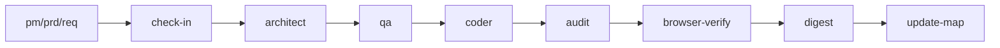

# 风险控制指南

## 风险控制架构

系统采用"统一入口 + 实施前对齐 + 质量门禁 + 审计放行 + 复盘沉淀"的闭环设计。

---

## 风险等级分类

| 等级 | 审计模式 | 关注点 |
|------|----------|--------|
| 低风险 | 轻审 | 越界修改、调试残留 |
| 中风险 | 重审 | 安全边界、回归风险 |
| 高风险 | 重审 + Web3 特殊项 | 资金、权限、数据可信度 |

---

## 核心控制策略

| 控制节点 | 作用 | 关键规则 |
|----------|------|----------|
| origin | 统一入口，集中审计追踪 | 不允许跳过直接进入主链 |
| check-in | 实施前门禁，防止盲目实施 | 必须明确"不做什么"和完成标准 |
| qa | 测试驱动验证 | FEAT 先 RED 后 GREEN；PATCH 轻量回归 |
| architect | 契约与边界约束 | 降低跨模块耦合安全风险 |
| coder | 编码自愈循环 | 最多 10 轮，超限输出 STUCK 报告 |
| audit | 量化评分门禁 | >=80 通过；60-79 回退；<60 终止 |
| browser-verify | UI/交互层验收 | 补充自动化测试覆盖不足 |

---

## 审计评分维度（满分100）

- 需求一致性
- 结构/契约一致性
- 安全与风险边界
- 代码质量
- 回归风险控制
- 文档与状态收尾
- 场景特定治理项

**一票否决项**：严重安全问题、明显越界修改、关键不变量被破坏、高风险场景缺少降级方案

---

## Web3 特殊安全考虑

| 领域 | 关注点 | 控制阶段 |
|------|--------|----------|
| 智能合约交互 | 重入/溢出/除零、权限最小化 | coder + audit |
| 交易安全 | Gas 估算上限、签名流程、私钥管理 | req + qa + digest |
| 资金保护 | 退款回滚验证、失败降级策略 | audit + browser-verify |

---

## 应急响应

**触发条件**：一票否决项（严重安全/越界修改/不变量破坏/缺少降级）

**处置步骤**：立即终止 -> 人工介入 -> 回溯原因 -> 修复验证 -> 更新审计结论 -> digest 沉淀经验
