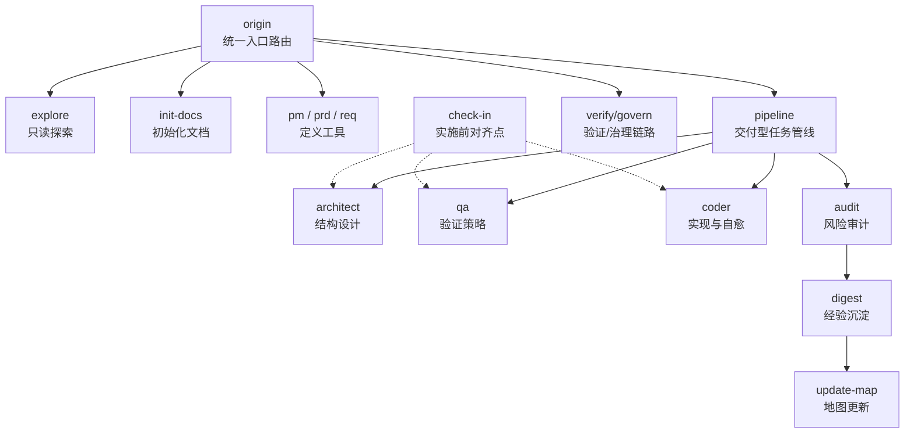
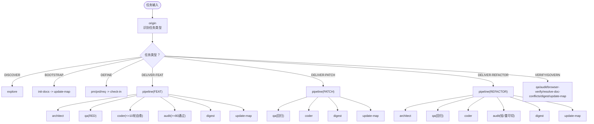
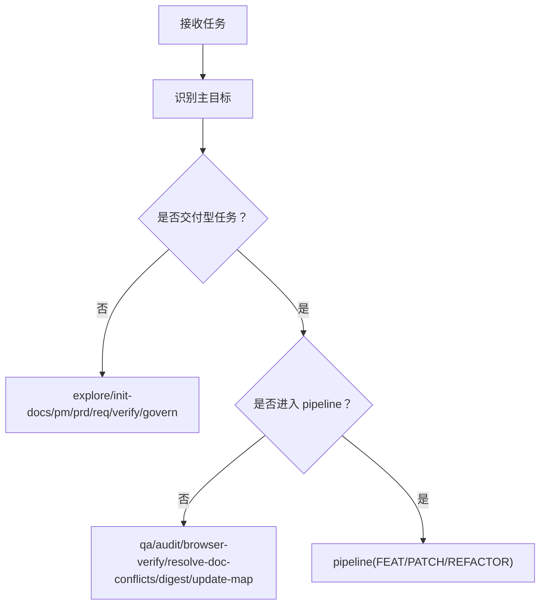
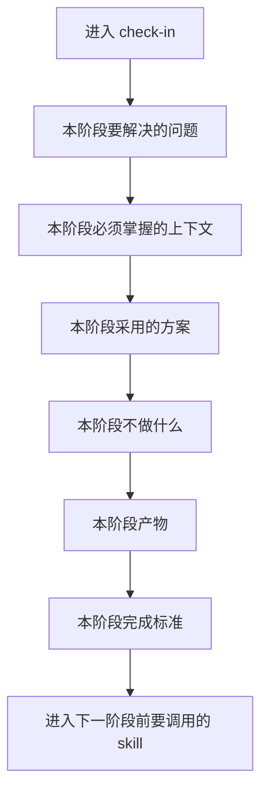
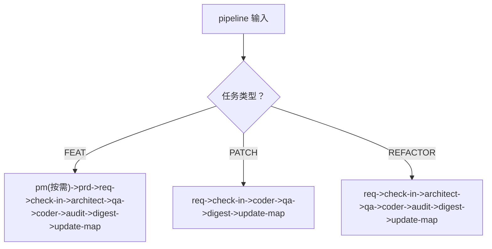
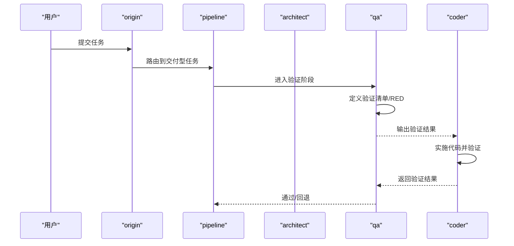
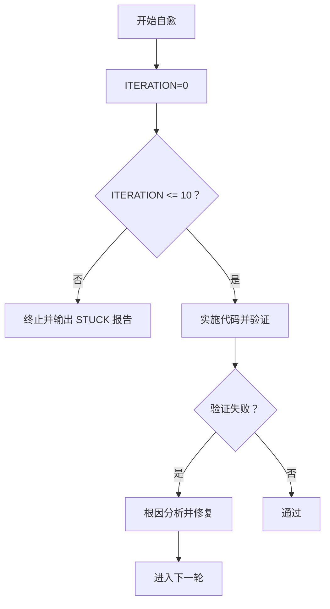
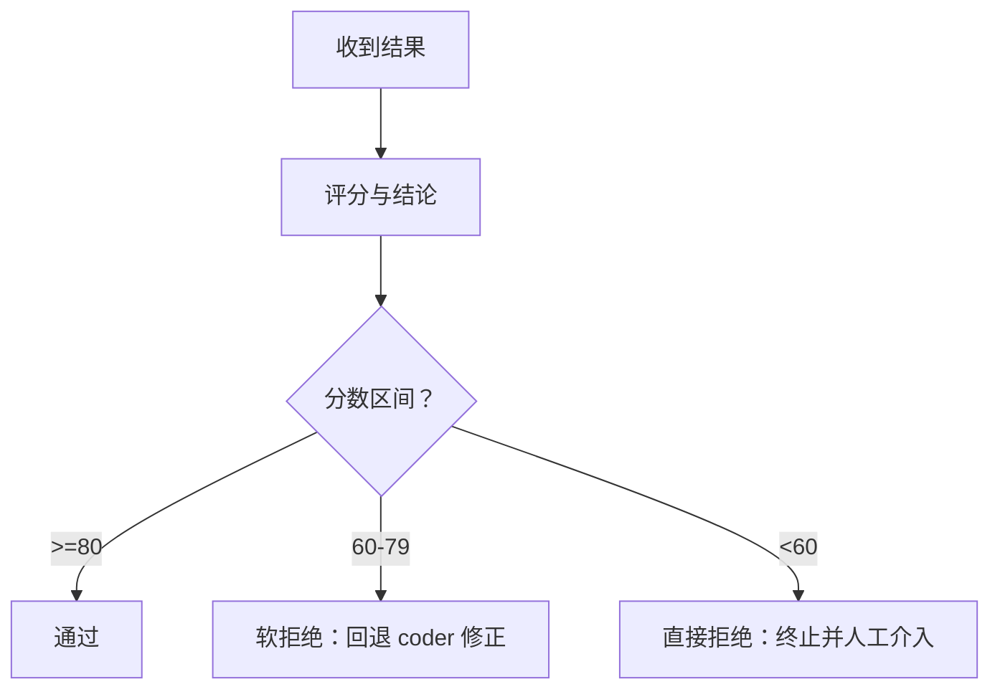
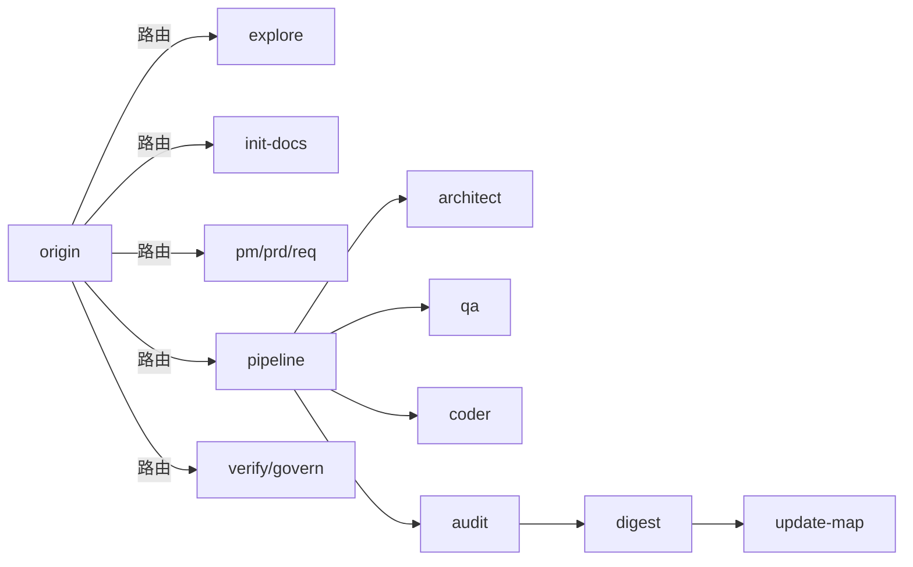

# 故障排除指南

<cite>
**本文引用的文件**
- [skills\web3-ai-agent\SKILL.md](file://skills/web3-ai-agent/SKILL.md)
- [skills\web3-ai-agent\COMMANDS.md](file://skills/web3-ai-agent/COMMANDS.md)
- [skills\web3-ai-agent\SKILL-SYSTEM-DESIGN-V3.md](file://skills/web3-ai-agent/SKILL-SYSTEM-DESIGN-V3.md)
- [skills\web3-ai-agent\origin\SKILL.md](file://skills/web3-ai-agent/origin/SKILL.md)
- [skills\web3-ai-agent\check-in\SKILL.md](file://skills/web3-ai-agent/check-in/SKILL.md)
- [skills\web3-ai-agent\pipeline\SKILL.md](file://skills/web3-ai-agent/pipeline/SKILL.md)
- [skills\web3-ai-agent\architect\SKILL.md](file://skills/web3-ai-agent/architect/SKILL.md)
- [skills\web3-ai-agent\qa\SKILL.md](file://skills/web3-ai-agent/qa/SKILL.md)
- [skills\web3-ai-agent\coder\SKILL.md](file://skills/web3-ai-agent/coder/SKILL.md)
- [skills\web3-ai-agent\audit\SKILL.md](file://skills/web3-ai-agent/audit/SKILL.md)
- [skills\web3-ai-agent\digest\SKILL.md](file://skills/web3-ai-agent/digest/SKILL.md)
- [skills\web3-ai-agent\explore\SKILL.md](file://skills/web3-ai-agent/explore/SKILL.md)
- [skills\web3-ai-agent\init-docs\SKILL.md](file://skills/web3-ai-agent/init-docs/SKILL.md)
</cite>

## 目录
1. [简介](#简介)
2. [项目结构](#项目结构)
3. [核心组件](#核心组件)
4. [架构总览](#架构总览)
5. [详细组件分析](#详细组件分析)
6. [依赖分析](#依赖分析)
7. [性能考虑](#性能考虑)
8. [故障排除指南](#故障排除指南)
9. [结论](#结论)
10. [附录](#附录)

## 简介
本指南面向使用与维护 AI-Agent 技能系统的用户与开发者，聚焦于“Web3 AI Agent 技能系统”的实际运行与排障。内容涵盖安装配置问题、技能执行错误、文档冲突与学习门禁（check-in）失败等常见问题的诊断与修复；提供日志分析、错误追踪与性能监控方法；给出系统监控与健康检查最佳实践；并包含预防性维护与优化建议，以及社区支持与反馈渠道。

## 项目结构
该仓库以“技能（Skill）”为中心，围绕统一入口 origin 构建路由与执行骨架，按任务类型分流至不同子链路。关键文件与职责如下：
- 入口与总览：SKILL.md、COMMANDS.md、SKILL-SYSTEM-DESIGN-V3.md
- 路由与门禁：origin、check-in、pipeline
- 交付链路：architect、qa、coder、audit
- 收尾与治理：digest、update-map
- 辅助能力：explore、init-docs、browser-verify、resolve-doc-conflicts

图表来源
- [skills\web3-ai-agent\SKILL.md:1-224](file://skills/web3-ai-agent/SKILL.md#L1-L224)
- [skills\web3-ai-agent\SKILL-SYSTEM-DESIGN-V3.md:1-719](file://skills/web3-ai-agent/SKILL-SYSTEM-DESIGN-V3.md#L1-L719)
- [skills\web3-ai-agent\origin\SKILL.md:1-125](file://skills/web3-ai-agent/origin/SKILL.md#L1-L125)
- [skills\web3-ai-agent\check-in\SKILL.md:1-56](file://skills/web3-ai-agent/check-in/SKILL.md#L1-L56)
- [skills\web3-ai-agent\pipeline\SKILL.md:1-89](file://skills/web3-ai-agent/pipeline/SKILL.md#L1-L89)
- [skills\web3-ai-agent\architect\SKILL.md:1-53](file://skills/web3-ai-agent/architect/SKILL.md#L1-L53)
- [skills\web3-ai-agent\qa\SKILL.md:1-73](file://skills/web3-ai-agent/qa/SKILL.md#L1-L73)
- [skills\web3-ai-agent\coder\SKILL.md:1-72](file://skills/web3-ai-agent/coder/SKILL.md#L1-L72)
- [skills\web3-ai-agent\audit\SKILL.md:1-88](file://skills/web3-ai-agent/audit/SKILL.md#L1-L88)
- [skills\web3-ai-agent\digest\SKILL.md:1-50](file://skills/web3-ai-agent/digest/SKILL.md#L1-L50)

章节来源
- [skills\web3-ai-agent\SKILL.md:1-224](file://skills/web3-ai-agent/SKILL.md#L1-L224)
- [skills\web3-ai-agent\COMMANDS.md:1-81](file://skills/web3-ai-agent/COMMANDS.md#L1-L81)
- [skills\web3-ai-agent\SKILL-SYSTEM-DESIGN-V3.md:1-719](file://skills/web3-ai-agent/SKILL-SYSTEM-DESIGN-V3.md#L1-L719)

## 核心组件
- origin：统一入口路由，负责任务类型识别与下一跳决策，禁止跳过与直接实施。
- pipeline：仅服务于交付型任务，按 FEAT/PATCH/REFACTOR 选择执行深度，避免默认全链路。
- check-in：实施前对齐点，强制适用于交付与准备进入实施的 DEFINE 任务，必须明确“不做什么”与完成标准。
- architect：结构设计，模块边界、接口契约、数据/消息流、错误处理与风险点。
- qa：验证策略制定与执行，FEAT 优先 RED，PATCH/REFACTOR 优先回归验证。
- coder：实现与自愈，最多 10 轮自愈，超限输出 STUCK 报告并请求人工介入。
- audit：风险审计与评分，总分 100，>=80 通过，60-79 软拒绝，<60 直接拒绝。
- digest/update-map：经验沉淀与地图更新，形成闭环。

章节来源
- [skills\web3-ai-agent\origin\SKILL.md:1-125](file://skills/web3-ai-agent/origin/SKILL.md#L1-L125)
- [skills\web3-ai-agent\pipeline\SKILL.md:1-89](file://skills/web3-ai-agent/pipeline/SKILL.md#L1-L89)
- [skills\web3-ai-agent\check-in\SKILL.md:1-56](file://skills/web3-ai-agent/check-in/SKILL.md#L1-L56)
- [skills\web3-ai-agent\architect\SKILL.md:1-53](file://skills/web3-ai-agent/architect/SKILL.md#L1-L53)
- [skills\web3-ai-agent\qa\SKILL.md:1-73](file://skills/web3-ai-agent/qa/SKILL.md#L1-L73)
- [skills\web3-ai-agent\coder\SKILL.md:1-72](file://skills/web3-ai-agent/coder/SKILL.md#L1-L72)
- [skills\web3-ai-agent\audit\SKILL.md:1-88](file://skills/web3-ai-agent/audit/SKILL.md#L1-L88)
- [skills\web3-ai-agent\digest\SKILL.md:1-50](file://skills/web3-ai-agent/digest/SKILL.md#L1-L50)

## 架构总览
系统以“任务类型 → 管线/链路 → 交付/治理”为主线，强调“最少步骤送入正确路径、高风险任务强约束、低风险任务降消耗”。核心路由与硬规则见下图：

图表来源
- [skills\web3-ai-agent\SKILL-SYSTEM-DESIGN-V3.md:222-285](file://skills/web3-ai-agent/SKILL-SYSTEM-DESIGN-V3.md#L222-L285)
- [skills\web3-ai-agent\SKILL-SYSTEM-DESIGN-V3.md:288-392](file://skills/web3-ai-agent/SKILL-SYSTEM-DESIGN-V3.md#L288-L392)
- [skills\web3-ai-agent\SKILL-SYSTEM-DESIGN-V3.md:395-436](file://skills/web3-ai-agent/SKILL-SYSTEM-DESIGN-V3.md#L395-L436)
- [skills\web3-ai-agent\SKILL-SYSTEM-DESIGN-V3.md:439-601](file://skills/web3-ai-agent/SKILL-SYSTEM-DESIGN-V3.md#L439-L601)
- [skills\web3-ai-agent\SKILL-SYSTEM-DESIGN-V3.md:696-719](file://skills/web3-ai-agent/SKILL-SYSTEM-DESIGN-V3.md#L696-L719)

## 详细组件分析

### 组件：origin（统一入口路由）
- 职责：识别任务类型（DISCOVER/BOOTSTRAP/DEFINE/DELIVER-FEAT/DELIVER-PATCH/DELIVER-REFACTOR/VERIFY/GOVERN），决定是否进入 pipeline 与 check-in。
- 关键边界：不得跳过任务分类、不得直接写需求/代码、不得替代其他核心 skill。
- 常见问题：路由歧义导致链路错误；自然语言未按 /origin 解释。

图表来源
- [skills\web3-ai-agent\origin\SKILL.md:22-66](file://skills/web3-ai-agent/origin/SKILL.md#L22-L66)

章节来源
- [skills\web3-ai-agent\origin\SKILL.md:1-125](file://skills/web3-ai-agent/origin/SKILL.md#L1-L125)

### 组件：check-in（实施前对齐点）
- 职责：确认问题、边界、方案、完成标准；强制适用于交付与准备进入实施的 DEFINE。
- 硬规则：无 check-in 不得进入 architect/qa/coder；必须明确“不做什么”与完成标准。
- 常见问题：未输出完成标准即进入下一阶段；未明确“不做什么”。

图表来源
- [skills\web3-ai-agent\check-in\SKILL.md:25-35](file://skills/web3-ai-agent/check-in/SKILL.md#L25-L35)

章节来源
- [skills\web3-ai-agent\check-in\SKILL.md:1-56](file://skills/web3-ai-agent/check-in/SKILL.md#L1-L56)

### 组件：pipeline（交付型任务管线）
- 职责：按 FEAT/PATCH/REFACTOR 选择执行深度，避免默认全链路。
- 硬规则：无 check-in 不允许进入 architect/qa/coder；FEAT 默认必须有 prd+req；PATCH/REFACTOR 默认不走 pm/prd。
- 常见问题：绕过 check-in 直接进入 architect/qa/coder；FEAT 缺少 prd/req。

图表来源
- [skills\web3-ai-agent\pipeline\SKILL.md:29-58](file://skills/web3-ai-agent/pipeline/SKILL.md#L29-L58)

章节来源
- [skills\web3-ai-agent\pipeline\SKILL.md:1-89](file://skills/web3-ai-agent/pipeline/SKILL.md#L1-L89)

### 组件：architect（结构设计）
- 职责：模块边界、接口契约、数据/消息流、错误处理与风险点。
- 常见问题：纯局部修补却强行进入；需求边界变化未回退 prd/req。

章节来源
- [skills\web3-ai-agent\architect\SKILL.md:1-53](file://skills/web3-ai-agent/architect/SKILL.md#L1-L53)

### 组件：qa（验证策略）
- 职责：定义与执行验证策略；FEAT 先 RED，PATCH/REFACTOR 优先回归验证。
- 红绿灯规则：FEAT 先红后绿；coder 负责把 RED 全部变为 GREEN。
- 常见问题：RED 直接通过（测试过弱）；PATCH/REFACTOR 缺少回归检查。

图表来源
- [skills\web3-ai-agent\qa\SKILL.md:12-56](file://skills/web3-ai-agent/qa/SKILL.md#L12-L56)
- [skills\web3-ai-agent\coder\SKILL.md:18-37](file://skills/web3-ai-agent/coder/SKILL.md#L18-L37)

章节来源
- [skills\web3-ai-agent\qa\SKILL.md:1-73](file://skills/web3-ai-agent/qa/SKILL.md#L1-L73)
- [skills\web3-ai-agent\coder\SKILL.md:1-72](file://skills/web3-ai-agent/coder/SKILL.md#L1-L72)

### 组件：coder（实现与自愈）
- 职责：在边界清楚前提下实施代码，最多 10 轮自愈循环。
- 常见问题：超出 10 轮未通过；范围扩大未回退 req/check-in/architect。

图表来源
- [skills\web3-ai-agent\coder\SKILL.md:18-48](file://skills/web3-ai-agent/coder/SKILL.md#L18-L48)

章节来源
- [skills\web3-ai-agent\coder\SKILL.md:1-72](file://skills/web3-ai-agent/coder/SKILL.md#L1-L72)

### 组件：audit（风险审计与评分）
- 职责：交付前最后一道风险关，支持轻审/重审，总分 100。
- 评分阈值：>=80 通过；60-79 软拒绝；<60 直接拒绝；严重问题一票否决。
- 常见问题：轻审重审不匹配；一票否决项遗漏。

图表来源
- [skills\web3-ai-agent\audit\SKILL.md:52-68](file://skills/web3-ai-agent/audit/SKILL.md#L52-L68)

章节来源
- [skills\web3-ai-agent\audit\SKILL.md:1-88](file://skills/web3-ai-agent/audit/SKILL.md#L1-L88)

### 组件：digest/update-map（经验沉淀与地图更新）
- 职责：沉淀经验、记录问题与建议，更新地图与状态。
- 常见问题：复盘写成流水账；地图更新滞后。

章节来源
- [skills\web3-ai-agent\digest\SKILL.md:1-50](file://skills/web3-ai-agent/digest/SKILL.md#L1-L50)

### 组件：explore/init-docs（辅助能力）
- explore：只读探索，不进入交付链。
- init-docs：新项目初始化文档体系，完成后交由正常 V3 链路继续演化。

章节来源
- [skills\web3-ai-agent\explore\SKILL.md:1-42](file://skills/web3-ai-agent/explore/SKILL.md#L1-L42)
- [skills\web3-ai-agent\init-docs\SKILL.md:1-41](file://skills/web3-ai-agent/init-docs/SKILL.md#L1-L41)

## 依赖分析
- 耦合关系：origin 为唯一入口，决定是否进入 pipeline 与 check-in；pipeline 仅对交付型任务生效；architect/qa/coder/audit 依赖 check-in 的完成标准；digest/update-map 形成闭环。
- 潜在环路：各 skill 间通过“下一跳”单向传递，不存在直接循环依赖。
- 外部集成：browser-verify、resolve-doc-conflicts 作为治理辅助，不参与主交付链。

图表来源
- [skills\web3-ai-agent\SKILL-SYSTEM-DESIGN-V3.md:222-285](file://skills/web3-ai-agent/SKILL-SYSTEM-DESIGN-V3.md#L222-L285)
- [skills\web3-ai-agent\SKILL-SYSTEM-DESIGN-V3.md:439-601](file://skills/web3-ai-agent/SKILL-SYSTEM-DESIGN-V3.md#L439-L601)

章节来源
- [skills\web3-ai-agent\SKILL-SYSTEM-DESIGN-V3.md:1-719](file://skills/web3-ai-agent/SKILL-SYSTEM-DESIGN-V3.md#L1-L719)

## 性能考虑
- 路由分流：通过 origin 与 pipeline 降低无效链路开销，FEAT 默认较长链路，PATCH/REFACTOR 优先短链路。
- 自愈上限：coder 最多 10 轮自愈，避免长时间卡顿。
- 验证策略：FEAT 先 RED，避免盲目实现；PATCH/REFACTOR 保留回归检查，减少重复成本。
- 文档治理：digest 与 update-map 合并理解为 closeout，减少流程割裂感。

## 故障排除指南

### 一、安装与配置问题
- 症状：无法加载某些技能或命令不可用。
- 诊断要点：
  - 检查斜杠命令约定是否正确（/origin、/pipeline feat/patch/refactor、/pm、/prd、/req、/check-in、/architect、/qa、/coder、/audit、/digest、/update-map、/explore、/init-docs、/browser-verify、/resolve-doc-conflicts）。
  - 确认宿主产品是否支持命令下拉菜单，若不支持，仍建议使用约定格式以降低歧义。
- 修复步骤：
  - 使用推荐命令表中的格式发起任务。
  - 若宿主不支持下拉菜单，确保在输入框中以“/命令 + 描述”的形式书写。
- 相关文件
  - [斜杠命令约定:1-81](file://skills/web3-ai-agent/COMMANDS.md#L1-L81)
  - [主入口与命令推荐:178-224](file://skills/web3-ai-agent/SKILL.md#L178-L224)

章节来源
- [skills\web3-ai-agent\COMMANDS.md:1-81](file://skills/web3-ai-agent/COMMANDS.md#L1-L81)
- [skills\web3-ai-agent\SKILL.md:178-224](file://skills/web3-ai-agent/SKILL.md#L178-L224)

### 二、技能执行错误

#### 1. 路由错误（任务被错误分流）
- 症状：任务进入错误链路（例如 DISCOVER 被路由到 pipeline）。
- 诊断要点：
  - 检查 origin 的路由规则与任务类型判断。
  - 确认任务描述是否足够清晰，避免歧义。
- 修复步骤：
  - 使用 /origin 命令明确表达任务类型。
  - 对目标模糊的任务，先走 pm/prd/req 清晰化后再 check-in。
- 相关文件
  - [origin 路由规则:41-66](file://skills/web3-ai-agent/origin/SKILL.md#L41-L66)
  - [主入口到子 skill 映射:92-158](file://skills/web3-ai-agent/SKILL.md#L92-L158)

章节来源
- [skills\web3-ai-agent\origin\SKILL.md:1-125](file://skills/web3-ai-agent/origin/SKILL.md#L1-L125)
- [skills\web3-ai-agent\SKILL.md:92-158](file://skills/web3-ai-agent/SKILL.md#L92-L158)

#### 2. 未通过学习门禁（check-in）失败
- 症状：无法进入 architect/qa/coder；或进入后被中断。
- 诊断要点：
  - 检查是否满足“强制适用场景”（DELIVER-FEAT/DELIVER-PATCH/DELIVER-REFACTOR/准备进入实施的 DEFINE）。
  - 检查 check-in 输出是否包含“本阶段要解决的问题/必须掌握的上下文/采用的方案/不做什么/产物/完成标准/下一阶段 skill”。
- 修复步骤：
  - 在进入 architect/qa/coder 前，先执行 check-in 并完整输出模板。
  - 明确“不做什么”与完成标准，否则视为未完成。
- 相关文件
  - [check-in 强制适用场景与输出模板:12-35](file://skills/web3-ai-agent/check-in/SKILL.md#L12-L35)
  - [硬规则：无 check-in 不得进入 architect/qa/coder:51-56](file://skills/web3-ai-agent/check-in/SKILL.md#L51-L56)

章节来源
- [skills\web3-ai-agent\check-in\SKILL.md:1-56](file://skills/web3-ai-agent/check-in/SKILL.md#L1-L56)

#### 3. FEAT 未按 RED 流程执行
- 症状：FEAT 直接进入实现，或 RED 失败但未回退。
- 诊断要点：
  - 检查 qa 是否先执行 RED；coder 是否将 RED 全部变为 GREEN。
- 修复步骤：
  - FEAT 必须先 qa 执行 RED，再由 coder 将 RED 全部变为 GREEN。
  - 若 RED 直接通过，需修正测试用例。
- 相关文件
  - [qa 红绿灯规则:51-56](file://skills/web3-ai-agent/qa/SKILL.md#L51-L56)
  - [coder 红绿衔接与自愈上限:49-53](file://skills/web3-ai-agent/coder/SKILL.md#L49-L53)

章节来源
- [skills\web3-ai-agent\qa\SKILL.md:1-73](file://skills/web3-ai-agent/qa/SKILL.md#L1-L73)
- [skills\web3-ai-agent\coder\SKILL.md:1-72](file://skills/web3-ai-agent/coder/SKILL.md#L1-L72)

#### 4. PATCH/REFACTOR 缺少回归检查
- 症状：修复后未验证回归，或未保留轻量回归检查。
- 诊断要点：
  - 检查 qa 是否执行回归验证；coder 是否优先跑相关验证。
- 修复步骤：
  - PATCH/REFACTOR 至少保留轻量回归检查；coder 优先跑相关验证。
- 相关文件
  - [qa VERIFY 模式与规则:29-73](file://skills/web3-ai-agent/qa/SKILL.md#L29-L73)
  - [coder 验证优先与规则:67-72](file://skills/web3-ai-agent/coder/SKILL.md#L67-L72)

章节来源
- [skills\web3-ai-agent\qa\SKILL.md:1-73](file://skills/web3-ai-agent/qa/SKILL.md#L1-L73)
- [skills\web3-ai-agent\coder\SKILL.md:1-72](file://skills/web3-ai-agent/coder/SKILL.md#L1-L72)

#### 5. coder 超过 10 轮仍未通过
- 症状：任务卡住，输出 STUCK 报告并请求人工介入。
- 诊断要点：
  - 检查自愈循环次数与根因分析过程。
- 修复步骤：
  - 输出 STUCK 报告，包含卡住原因、已尝试方案、当前阻塞点与建议人工介入方向。
  - 由人工介入评估是否扩大范围或调整方案。
- 相关文件
  - [coder 自愈上限与 STUCK 报告:18-48](file://skills/web3-ai-agent/coder/SKILL.md#L18-L48)

章节来源
- [skills\web3-ai-agent\coder\SKILL.md:1-72](file://skills/web3-ai-agent/coder/SKILL.md#L1-L72)

#### 6. audit 评分不通过
- 症状：总分低于 80，或出现软拒绝/直接拒绝。
- 诊断要点：
  - 检查评分维度与阈值：>=80 通过，60-79 软拒绝，<60 直接拒绝。
  - 检查是否存在一票否决项（严重安全问题、关键不变量破坏、高风险场景缺少风险提示）。
- 修复步骤：
  - 通过：进入 digest；软拒绝：回退 coder 修正；直接拒绝：终止并人工介入或重定方案。
- 相关文件
  - [audit 评分规则与阈值:52-68](file://skills/web3-ai-agent/audit/SKILL.md#L52-L68)
  - [audit 一票否决项:70-77](file://skills/web3-ai-agent/audit/SKILL.md#L70-L77)

章节来源
- [skills\web3-ai-agent\audit\SKILL.md:1-88](file://skills/web3-ai-agent/audit/SKILL.md#L1-L88)

### 三、文档冲突与学习门禁失败

#### 1. 文档冲突处理
- 症状：文档合并冲突导致治理链路受阻。
- 诊断要点：
  - 检查 resolve-doc-conflicts 的执行情况。
- 修复步骤：
  - 使用 /resolve-doc-conflicts 命令处理冲突，确保文档一致性。
- 相关文件
  - [resolve-doc-conflicts 作用与流程:593-601](file://skills/web3-ai-agent/SKILL-SYSTEM-DESIGN-V3.md#L593-L601)

章节来源
- [skills\web3-ai-agent\SKILL-SYSTEM-DESIGN-V3.md:593-601](file://skills/web3-ai-agent/SKILL-SYSTEM-DESIGN-V3.md#L593-L601)

#### 2. 学习门禁（check-in）失败
- 症状：未明确完成标准或“不做什么”，导致后续链路中断。
- 诊断要点：
  - 检查 check-in 输出模板是否完整。
- 修复步骤：
  - 完整填写模板七要素；明确完成标准，否则视为未完成。
- 相关文件
  - [check-in 输出模板与硬规则:25-56](file://skills/web3-ai-agent/check-in/SKILL.md#L25-L56)

章节来源
- [skills\web3-ai-agent\check-in\SKILL.md:1-56](file://skills/web3-ai-agent/check-in/SKILL.md#L1-L56)

### 四、调试技巧与问题定位

- 日志分析
  - 在每个关键节点（origin、check-in、pipeline、architect、qa、coder、audit、digest）输出结构化结果，便于回溯。
  - 对 coder 的自愈循环，记录每轮失败信息与根因分析。
- 错误追踪
  - 使用“下一跳”字段追踪链路是否偏离；若出现“未完成”或“STUCK”，回溯至上一节点。
  - 对 audit 的软拒绝/直接拒绝，回溯到 coder/qa/architect 的输出。
- 性能监控
  - 监控 pipeline 各阶段耗时；FEAT 默认较长链路，PATCH/REFACTOR 应尽量缩短。
  - 对 coder 的自愈轮次进行统计，超过 10 轮需人工干预。

章节来源
- [skills\web3-ai-agent\coder\SKILL.md:18-48](file://skills/web3-ai-agent/coder/SKILL.md#L18-L48)
- [skills\web3-ai-agent\audit\SKILL.md:52-68](file://skills/web3-ai-agent/audit/SKILL.md#L52-L68)

### 五、系统监控与健康检查

- 健康检查清单
  - 路由正确率：origin 是否正确分流。
  - 门禁通过率：check-in 是否完整输出并满足完成标准。
  - 自愈成功率：coder 在 10 轮内通过的比例。
  - 审计通过率：audit >=80 的比例；软拒绝/直接拒绝的分布。
  - 文档治理：digest 与 update-map 的及时性与质量。
- 最佳实践
  - 对高频任务（PATCH/REFACTOR）优先短链路；对复杂任务（FEAT）严格 RED。
  - 对高风险任务启用重审；对低风险任务启用轻审。
  - 定期复盘 digest，沉淀经验并更新地图。

章节来源
- [skills\web3-ai-agent\SKILL-SYSTEM-DESIGN-V3.md:696-719](file://skills/web3-ai-agent/SKILL-SYSTEM-DESIGN-V3.md#L696-L719)
- [skills\web3-ai-agent\audit\SKILL.md:52-68](file://skills/web3-ai-agent/audit/SKILL.md#L52-L68)

### 六、预防性维护与优化策略

- 预防性维护
  - 定期清理过期文档与失效链接；保持地图与状态同步。
  - 对频繁出现的“范围扩大”问题，加强 req/architect 的前置校验。
- 优化策略
  - 对 RED 测试用例进行评审，避免过弱导致误判。
  - 对回归检查点进行精简，优先跑相关验证，减少全量重跑。
  - 对 audit 的评分维度进行回顾，确保与实际风险匹配。

章节来源
- [skills\web3-ai-agent\coder\SKILL.md:67-72](file://skills/web3-ai-agent/coder/SKILL.md#L67-L72)
- [skills\web3-ai-agent\audit\SKILL.md:52-68](file://skills/web3-ai-agent/audit/SKILL.md#L52-L68)

### 七、社区支持与问题反馈

- 社区支持资源
  - 斜杠命令约定与推荐命令表：用于降低路由歧义，提升协作效率。
- 问题反馈渠道
  - 在使用过程中遇到路由错误、门禁失败、自愈卡住、审计不通过等问题，请结合本指南进行定位与修复，并在团队内部进行复盘与改进。
- 相关文件
  - [斜杠命令约定与推荐命令表:1-81](file://skills/web3-ai-agent/COMMANDS.md#L1-L81)
  - [主入口与命令推荐:178-224](file://skills/web3-ai-agent/SKILL.md#L178-L224)

章节来源
- [skills\web3-ai-agent\COMMANDS.md:1-81](file://skills/web3-ai-agent/COMMANDS.md#L1-L81)
- [skills\web3-ai-agent\SKILL.md:178-224](file://skills/web3-ai-agent/SKILL.md#L178-L224)

## 结论
本指南基于 Web3 AI Agent 技能系统的设计文档与各技能文件，构建了从路由、门禁、交付到治理的完整排障路径。通过明确的硬规则与流程约束，结合日志分析、错误追踪与性能监控，可有效定位并解决安装配置、技能执行、文档冲突与学习门禁失败等问题。建议在日常使用中坚持“最少步骤送入正确路径、高风险强约束、低风险降消耗”的原则，并持续进行复盘与优化。

## 附录

### A. 常见错误代码与解释（示例）
- 错误代码：30404
  - 说明：文件不存在或类似文件被找到但路径不匹配。
  - 示例：MAP.md 文件缺失；系统提示相似文件列表。
  - 修复：确认文件名与路径大小写；根据系统提示选择正确文件。
- 建议：在使用前先核对文件清单，避免因大小写或路径差异导致的加载失败。

章节来源
- [skills\web3-ai-agent\SKILL-SYSTEM-DESIGN-V3.md:1-719](file://skills/web3-ai-agent/SKILL-SYSTEM-DESIGN-V3.md#L1-L719)

### B. 推荐命令表（摘要）
- /origin
- /pipeline feat
- /pipeline patch
- /pipeline refactor
- /pm
- /prd
- /req
- /check-in
- /architect
- /qa
- /coder
- /audit
- /digest
- /update-map
- /explore
- /init-docs
- /browser-verify
- /resolve-doc-conflicts

章节来源
- [skills\web3-ai-agent\COMMANDS.md:29-50](file://skills/web3-ai-agent/COMMANDS.md#L29-L50)